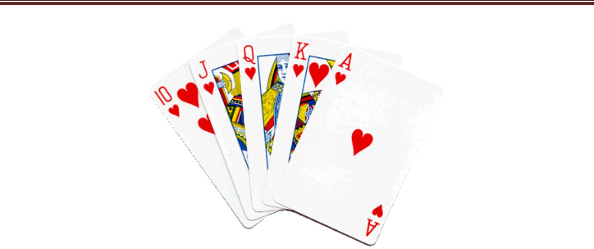
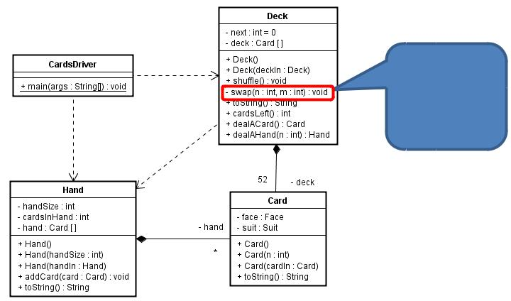

# Project 2B – Card-Deck-Hand

## Hand of Cards

**The Project**

Extend the *Deck-of-Cards* project you have developed previously with the *Card*
and *Deck* classes by adding a *Hand* class that implements the following *UML*
diagram:

Note that in addition to implementing the *Hand* class, you will need to modify
the *Deck’s dealAHand* method to return a *Hand* object instead of a *String*
object.

The *driver* should be modified so that it has a *Deck*. It should prompt the
user for the size of a *Hand* in the game being played and for the number of
players.

It should then *shuffle* the *Deck* and *deal* and display the *Hands* for all
players unless there are not enough *Cards* in the *Deck* (for example, we
cannot deal 10 *Hands* of 7 *Cards* from a *Deck* of 52 *Cards*). The *driver*
should display an error message if the user attempts to deal in an impossible
situation such as this.
